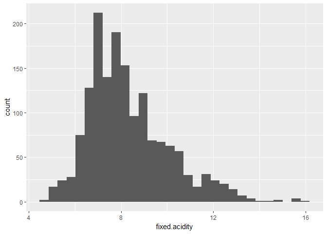
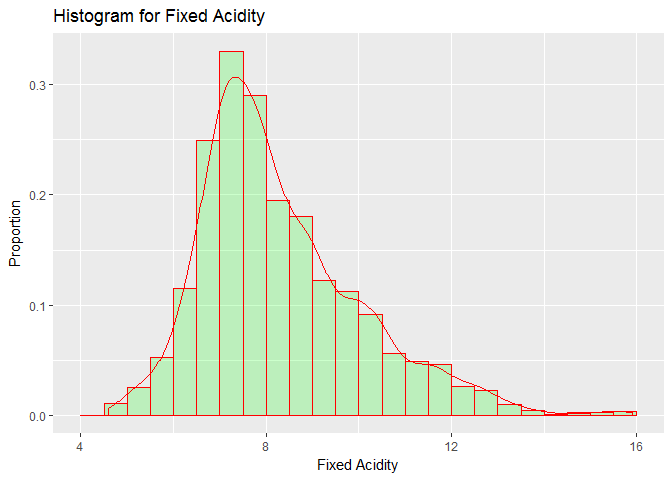

Red Wine
================
Melinda K. Higgins, PhD.
February 16, 2017

``` r
knitr::opts_chunk$set(echo = TRUE)

# define libraries
library(ggplot2)
```

Read in data
------------

NOTE: There are 2 formatting issues with the data as downloaded from the UCI data repository. Even though the filename extension is CSV (usually "comma-delimited" format),

1.  the variable names have multiple words separated by spaces which many/most import routines will have problems with and
2.  the "delimiter" or symbol used to separate data fields (aka, the columns) is the semicolon `;` so we need to specify this.

If it was a simple comma-delimtied file the function `read.csv()` would work fine. However, to address the issue of the semicolon, we need to use `read.table()` and provide the delimiter specifically.

NOTE: `read.table()` also "fixes" the variable names such that the spaces are filled in using a period `.`. For example, the 1st variable "fixed acidity" is converted to `fixed.acidity` in the final dataframe.

``` r
redWine <- read.table("winequality-red.csv",
                      header=TRUE,
                      sep=";")
```

Run a summary of the Red Wine Data
----------------------------------

``` r
summary(redWine)
```

    ##  fixed.acidity   volatile.acidity  citric.acid    residual.sugar  
    ##  Min.   : 4.60   Min.   :0.1200   Min.   :0.000   Min.   : 0.900  
    ##  1st Qu.: 7.10   1st Qu.:0.3900   1st Qu.:0.090   1st Qu.: 1.900  
    ##  Median : 7.90   Median :0.5200   Median :0.260   Median : 2.200  
    ##  Mean   : 8.32   Mean   :0.5278   Mean   :0.271   Mean   : 2.539  
    ##  3rd Qu.: 9.20   3rd Qu.:0.6400   3rd Qu.:0.420   3rd Qu.: 2.600  
    ##  Max.   :15.90   Max.   :1.5800   Max.   :1.000   Max.   :15.500  
    ##    chlorides       free.sulfur.dioxide total.sulfur.dioxide
    ##  Min.   :0.01200   Min.   : 1.00       Min.   :  6.00      
    ##  1st Qu.:0.07000   1st Qu.: 7.00       1st Qu.: 22.00      
    ##  Median :0.07900   Median :14.00       Median : 38.00      
    ##  Mean   :0.08747   Mean   :15.87       Mean   : 46.47      
    ##  3rd Qu.:0.09000   3rd Qu.:21.00       3rd Qu.: 62.00      
    ##  Max.   :0.61100   Max.   :72.00       Max.   :289.00      
    ##     density             pH          sulphates         alcohol     
    ##  Min.   :0.9901   Min.   :2.740   Min.   :0.3300   Min.   : 8.40  
    ##  1st Qu.:0.9956   1st Qu.:3.210   1st Qu.:0.5500   1st Qu.: 9.50  
    ##  Median :0.9968   Median :3.310   Median :0.6200   Median :10.20  
    ##  Mean   :0.9967   Mean   :3.311   Mean   :0.6581   Mean   :10.42  
    ##  3rd Qu.:0.9978   3rd Qu.:3.400   3rd Qu.:0.7300   3rd Qu.:11.10  
    ##  Max.   :1.0037   Max.   :4.010   Max.   :2.0000   Max.   :14.90  
    ##     quality     
    ##  Min.   :3.000  
    ##  1st Qu.:5.000  
    ##  Median :6.000  
    ##  Mean   :5.636  
    ##  3rd Qu.:6.000  
    ##  Max.   :8.000

Histogram of Fixed Acidity using `ggplot()`
-------------------------------------------

``` r
ggplot(aes(fixed.acidity), data=redWine) +
  geom_histogram()
```

    ## `stat_bin()` using `bins = 30`. Pick better value with `binwidth`.



Density Overlay with Histogram & add color
------------------------------------------

``` r
ggplot(aes(fixed.acidity), data=redWine) + 
  geom_histogram(aes(y =..density..), 
                 breaks=seq(4, 16, by = 0.5), 
                 col="red", 
                 fill="green", 
                 alpha = .2) + 
  geom_density(col=2) + 
  labs(title="Histogram for Fixed Acidity") +
  labs(x="Fixed Acidity", y="Proportion")
```


