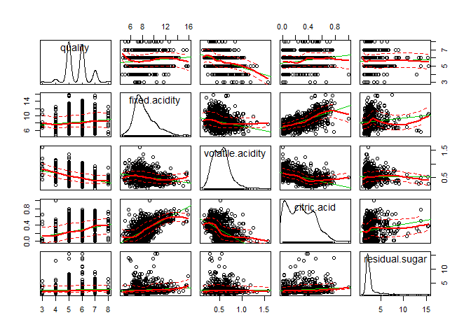
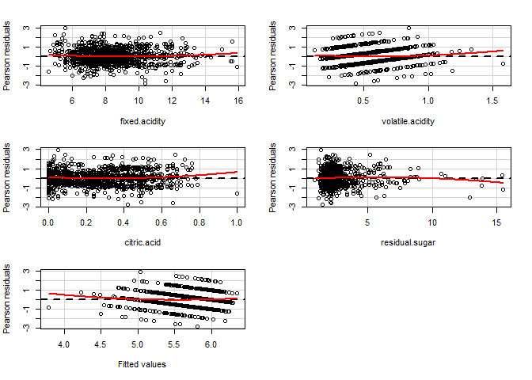
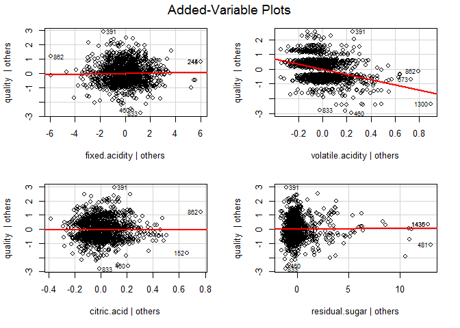
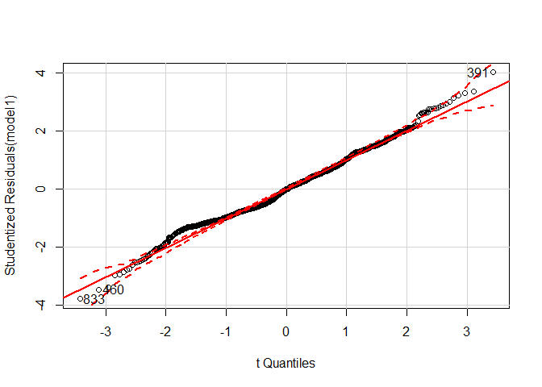
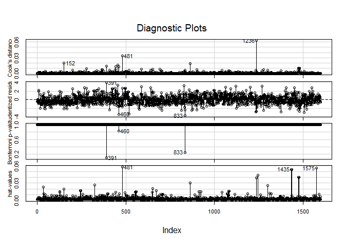

Red Wine
================
Melinda K. Higgins, PhD.
February 16, 2017

``` r
# code chunk setting for RMD file
knitr::opts_chunk$set(echo = TRUE)

# load packages for RMD file
# any functions/code you use in your
# RMD file must have the correct package library
# loaded BEFORE you try to use the command/function
# or you will get errors when you knit the RMD file
library(ggplot2)
```

Read in data
------------

NOTE: There are 2 formatting issues with the data as downloaded from the UCI data repository. Even though the filename extension is CSV (usually "comma-delimited" format),

1.  the variable names have multiple words separated by spaces which many/most import routines will have problems with and
2.  the "delimiter" or symbol used to separate data fields (aka, the columns) is the semicolon `;` so we need to specify this.

If it was a simple comma-delimtied file the function `read.csv()` would work fine. However, to address the issue of the semicolon, we need to use `read.table()` and provide the delimiter specifically.

NOTE: `read.table()` also "fixes" the variable names such that the spaces are filled in using a period `.`. For example, the 1st variable "fixed acidity" is converted to `fixed.acidity` in the final dataframe.

``` r
# make sure the code to read in the
# data is in your RMD file otherwise
# when you knit, you will get errors
redWine <- read.table("winequality-red.csv",
                      header=TRUE,
                      sep=";")
```

Run a summary of the Red Wine Data
----------------------------------

``` r
summary(redWine)
```

    ##  fixed.acidity   volatile.acidity  citric.acid    residual.sugar  
    ##  Min.   : 4.60   Min.   :0.1200   Min.   :0.000   Min.   : 0.900  
    ##  1st Qu.: 7.10   1st Qu.:0.3900   1st Qu.:0.090   1st Qu.: 1.900  
    ##  Median : 7.90   Median :0.5200   Median :0.260   Median : 2.200  
    ##  Mean   : 8.32   Mean   :0.5278   Mean   :0.271   Mean   : 2.539  
    ##  3rd Qu.: 9.20   3rd Qu.:0.6400   3rd Qu.:0.420   3rd Qu.: 2.600  
    ##  Max.   :15.90   Max.   :1.5800   Max.   :1.000   Max.   :15.500  
    ##    chlorides       free.sulfur.dioxide total.sulfur.dioxide
    ##  Min.   :0.01200   Min.   : 1.00       Min.   :  6.00      
    ##  1st Qu.:0.07000   1st Qu.: 7.00       1st Qu.: 22.00      
    ##  Median :0.07900   Median :14.00       Median : 38.00      
    ##  Mean   :0.08747   Mean   :15.87       Mean   : 46.47      
    ##  3rd Qu.:0.09000   3rd Qu.:21.00       3rd Qu.: 62.00      
    ##  Max.   :0.61100   Max.   :72.00       Max.   :289.00      
    ##     density             pH          sulphates         alcohol     
    ##  Min.   :0.9901   Min.   :2.740   Min.   :0.3300   Min.   : 8.40  
    ##  1st Qu.:0.9956   1st Qu.:3.210   1st Qu.:0.5500   1st Qu.: 9.50  
    ##  Median :0.9968   Median :3.310   Median :0.6200   Median :10.20  
    ##  Mean   :0.9967   Mean   :3.311   Mean   :0.6581   Mean   :10.42  
    ##  3rd Qu.:0.9978   3rd Qu.:3.400   3rd Qu.:0.7300   3rd Qu.:11.10  
    ##  Max.   :1.0037   Max.   :4.010   Max.   :2.0000   Max.   :14.90  
    ##     quality     
    ##  Min.   :3.000  
    ##  1st Qu.:5.000  
    ##  Median :6.000  
    ##  Mean   :5.636  
    ##  3rd Qu.:6.000  
    ##  Max.   :8.000

Histogram of Fixed Acidity using `ggplot()`
-------------------------------------------

``` r
# aes() defines which variable you want the 
# histogram for.
ggplot(aes(fixed.acidity), data=redWine) +
  geom_histogram()
```

    ## `stat_bin()` using `bins = 30`. Pick better value with `binwidth`.


Density Overlay with Histogram & add color
------------------------------------------

The code below adn be modified as you wish to make more interesting histograms with an overlaid density curve.

``` r
# remember aes(..density..) is what you use to
# change from a frequency based (counts) histogram
# to one based on the proportions or "density"
# breaks=seq(4, 16, by = 0.5) defines the breakpoints
# we want to see for this variable "fixed.acidity"
# col="red" defines the outline color of each bar
# fill="green" defines the color inside each bar
# alpha=.2 is the transparency level for the fill color
# the overlaid geom_density() col is also "red" (color 2)
# finally custom title, xlabel and ylabel are provided
ggplot(aes(fixed.acidity), data=redWine) + 
  geom_histogram(aes(y =..density..), 
                 breaks=seq(4, 16, by = 0.5), 
                 col="red", 
                 fill="green", 
                 alpha = .2) + 
  geom_density(col=2) + 
  labs(title="Histogram for Fixed Acidity") +
  labs(x="Fixed Acidity", y="Proportion")
```


Example Scatterplot Matrix
--------------------------

``` r
# load car package - to use scatterplotMatrix()
library(car)

# make scatterplot matrix for quality and 
# some of the first variables
scatterplotMatrix(~ quality + fixed.acidity +
                     volatile.acidity + citric.acid +
                     residual.sugar, data=redWine)
```



try a linear model and summarize
--------------------------------

``` r
model1 <- lm(quality ~ fixed.acidity +
                     volatile.acidity + citric.acid +
                     residual.sugar, data=redWine)
summary(model1)
```

    ## 
    ## Call:
    ## lm(formula = quality ~ fixed.acidity + volatile.acidity + citric.acid + 
    ##     residual.sugar, data = redWine)
    ## 
    ## Residuals:
    ##      Min       1Q   Median       3Q      Max 
    ## -2.80507 -0.54417 -0.00606  0.46266  2.96516 
    ## 
    ## Coefficients:
    ##                   Estimate Std. Error t value Pr(>|t|)    
    ## (Intercept)       6.438658   0.123213  52.256   <2e-16 ***
    ## fixed.acidity     0.013898   0.014687   0.946    0.344    
    ## volatile.acidity -1.752413   0.127508 -13.744   <2e-16 ***
    ## citric.acid      -0.042391   0.153477  -0.276    0.782    
    ## residual.sugar    0.007163   0.013404   0.534    0.593    
    ## ---
    ## Signif. codes:  0 '***' 0.001 '**' 0.01 '*' 0.05 '.' 0.1 ' ' 1
    ## 
    ## Residual standard error: 0.744 on 1594 degrees of freedom
    ## Multiple R-squared:  0.1533, Adjusted R-squared:  0.1512 
    ## F-statistic: 72.17 on 4 and 1594 DF,  p-value: < 2.2e-16

run a 2nd model and compare
---------------------------

Drop all non-significant variables - so keep "volatile.acidity" and run again

``` r
model2 <- lm(quality ~ volatile.acidity, data=redWine)
summary(model2)
```

    ## 
    ## Call:
    ## lm(formula = quality ~ volatile.acidity, data = redWine)
    ## 
    ## Residuals:
    ##      Min       1Q   Median       3Q      Max 
    ## -2.79071 -0.54411 -0.00687  0.47350  2.93148 
    ## 
    ## Coefficients:
    ##                  Estimate Std. Error t value Pr(>|t|)    
    ## (Intercept)       6.56575    0.05791  113.39   <2e-16 ***
    ## volatile.acidity -1.76144    0.10389  -16.95   <2e-16 ***
    ## ---
    ## Signif. codes:  0 '***' 0.001 '**' 0.01 '*' 0.05 '.' 0.1 ' ' 1
    ## 
    ## Residual standard error: 0.7437 on 1597 degrees of freedom
    ## Multiple R-squared:  0.1525, Adjusted R-squared:  0.152 
    ## F-statistic: 287.4 on 1 and 1597 DF,  p-value: < 2.2e-16

Compare these 2 linear models
-----------------------------

We can use the `stargazer` package to compare 2 similar models. In order for the tables to work correctly for HTML output, you need to do 2 things: (1) add `results="asis"` to the `R` code chunk option and (2) add `type="html"` as an option in the `stargazer()` function call.

***WARNING**: This approach will NOT work if you "knit" to DOCX or PDF. It only works for HTML output.*

``` r
library(stargazer)
```

    ## 
    ## Please cite as:

    ##  Hlavac, Marek (2015). stargazer: Well-Formatted Regression and Summary Statistics Tables.

    ##  R package version 5.2. http://CRAN.R-project.org/package=stargazer

``` r
stargazer(model1, model2, 
          title="Comparison of 2 Regression outputs",
          type="html")
```

<table style="text-align:center">
<caption>
<strong>Comparison of 2 Regression outputs</strong>
</caption>
<tr>
<td colspan="3" style="border-bottom: 1px solid black">
</td>
</tr>
<tr>
<td style="text-align:left">
</td>
<td colspan="2">
<em>Dependent variable:</em>
</td>
</tr>
<tr>
<td>
</td>
<td colspan="2" style="border-bottom: 1px solid black">
</td>
</tr>
<tr>
<td style="text-align:left">
</td>
<td colspan="2">
quality
</td>
</tr>
<tr>
<td style="text-align:left">
</td>
<td>
(1)
</td>
<td>
(2)
</td>
</tr>
<tr>
<td colspan="3" style="border-bottom: 1px solid black">
</td>
</tr>
<tr>
<td style="text-align:left">
fixed.acidity
</td>
<td>
0.014
</td>
<td>
</td>
</tr>
<tr>
<td style="text-align:left">
</td>
<td>
(0.015)
</td>
<td>
</td>
</tr>
<tr>
<td style="text-align:left">
</td>
<td>
</td>
<td>
</td>
</tr>
<tr>
<td style="text-align:left">
volatile.acidity
</td>
<td>
-1.752<sup>\*\*\*</sup>
</td>
<td>
-1.761<sup>\*\*\*</sup>
</td>
</tr>
<tr>
<td style="text-align:left">
</td>
<td>
(0.128)
</td>
<td>
(0.104)
</td>
</tr>
<tr>
<td style="text-align:left">
</td>
<td>
</td>
<td>
</td>
</tr>
<tr>
<td style="text-align:left">
citric.acid
</td>
<td>
-0.042
</td>
<td>
</td>
</tr>
<tr>
<td style="text-align:left">
</td>
<td>
(0.153)
</td>
<td>
</td>
</tr>
<tr>
<td style="text-align:left">
</td>
<td>
</td>
<td>
</td>
</tr>
<tr>
<td style="text-align:left">
residual.sugar
</td>
<td>
0.007
</td>
<td>
</td>
</tr>
<tr>
<td style="text-align:left">
</td>
<td>
(0.013)
</td>
<td>
</td>
</tr>
<tr>
<td style="text-align:left">
</td>
<td>
</td>
<td>
</td>
</tr>
<tr>
<td style="text-align:left">
Constant
</td>
<td>
6.439<sup>\*\*\*</sup>
</td>
<td>
6.566<sup>\*\*\*</sup>
</td>
</tr>
<tr>
<td style="text-align:left">
</td>
<td>
(0.123)
</td>
<td>
(0.058)
</td>
</tr>
<tr>
<td style="text-align:left">
</td>
<td>
</td>
<td>
</td>
</tr>
<tr>
<td colspan="3" style="border-bottom: 1px solid black">
</td>
</tr>
<tr>
<td style="text-align:left">
Observations
</td>
<td>
1,599
</td>
<td>
1,599
</td>
</tr>
<tr>
<td style="text-align:left">
R<sup>2</sup>
</td>
<td>
0.153
</td>
<td>
0.153
</td>
</tr>
<tr>
<td style="text-align:left">
Adjusted R<sup>2</sup>
</td>
<td>
0.151
</td>
<td>
0.152
</td>
</tr>
<tr>
<td style="text-align:left">
Residual Std. Error
</td>
<td>
0.744 (df = 1594)
</td>
<td>
0.744 (df = 1597)
</td>
</tr>
<tr>
<td style="text-align:left">
F Statistic
</td>
<td>
72.166<sup>\*\*\*</sup> (df = 4; 1594)
</td>
<td>
287.444<sup>\*\*\*</sup> (df = 1; 1597)
</td>
</tr>
<tr>
<td colspan="3" style="border-bottom: 1px solid black">
</td>
</tr>
<tr>
<td style="text-align:left">
<em>Note:</em>
</td>
<td colspan="2" style="text-align:right">
<sup>*</sup>p&lt;0.1; <sup>**</sup>p&lt;0.05; <sup>***</sup>p&lt;0.01
</td>
</tr>
</table>
If you want a format that will work for all of the output formats (HTML, DOCX and PDF), use `type="text"` option which will give simple R text-based output.

``` r
stargazer(model1, model2, 
          title="Comparison of 2 Regression outputs",
          type="text")
```

    ## 
    ## Comparison of 2 Regression outputs
    ## ======================================================================
    ##                                    Dependent variable:                
    ##                     --------------------------------------------------
    ##                                          quality                      
    ##                               (1)                       (2)           
    ## ----------------------------------------------------------------------
    ## fixed.acidity                0.014                                    
    ##                             (0.015)                                   
    ##                                                                       
    ## volatile.acidity           -1.752***                 -1.761***        
    ##                             (0.128)                   (0.104)         
    ##                                                                       
    ## citric.acid                  -0.042                                   
    ##                             (0.153)                                   
    ##                                                                       
    ## residual.sugar               0.007                                    
    ##                             (0.013)                                   
    ##                                                                       
    ## Constant                    6.439***                 6.566***         
    ##                             (0.123)                   (0.058)         
    ##                                                                       
    ## ----------------------------------------------------------------------
    ## Observations                 1,599                     1,599          
    ## R2                           0.153                     0.153          
    ## Adjusted R2                  0.151                     0.152          
    ## Residual Std. Error    0.744 (df = 1594)         0.744 (df = 1597)    
    ## F Statistic         72.166*** (df = 4; 1594) 287.444*** (df = 1; 1597)
    ## ======================================================================
    ## Note:                                      *p<0.1; **p<0.05; ***p<0.01

look at some diagnostic plots
-----------------------------

``` r
residualPlots(model1)
```



    ##                  Test stat Pr(>|t|)
    ## fixed.acidity        1.924    0.055
    ## volatile.acidity     1.882    0.060
    ## citric.acid          3.086    0.002
    ## residual.sugar      -2.140    0.032
    ## Tukey test           2.005    0.045

``` r
avPlots(model1, id.n=3, id.cex=0.7)
```



``` r
qqPlot(model1, id.n=3)
```



    ##  833  460  391 
    ##    1    2 1599

``` r
influenceIndexPlot(model1, id.n=3)
```



Other diagnostics
-----------------

``` r
outlierTest(model1)
```

    ## 
    ## No Studentized residuals with Bonferonni p < 0.05
    ## Largest |rstudent|:
    ##     rstudent unadjusted p-value Bonferonni p
    ## 391 4.012657         6.2824e-05      0.10046

``` r
ncvTest(model1)
```

    ## Non-constant Variance Score Test 
    ## Variance formula: ~ fitted.values 
    ## Chisquare = 1.001733    Df = 1     p = 0.3168916

``` r
vif(model1)
```

    ##    fixed.acidity volatile.acidity      citric.acid   residual.sugar 
    ##         1.887647         1.504806         2.580376         1.031098
